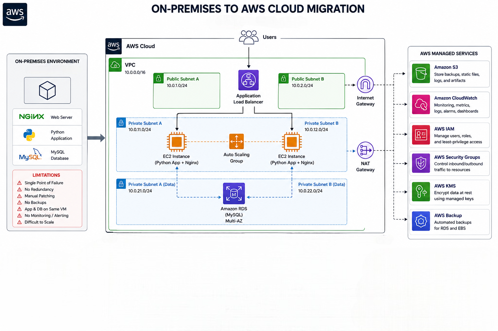

# On-Premises to AWS Cloud Migration

A hands-on portfolio project demonstrating the planning and execution of migrating a small on-premises application to AWS — from a single fragile VM to a properly networked, security-conscious cloud deployment.

## Overview

This project takes a simple Flask + MySQL "notes" application, originally running on a single on-premises Linux VM, and migrates it to AWS using EC2 and RDS. The goal wasn't just to move the app — it was to demonstrate *why* each architectural decision matters: separating the app and database layers, securing traffic with properly scoped security groups, using IAM roles instead of embedded credentials, and documenting a clear path toward high availability.

The [architecture diagram](images/AWS_Architecture.png) above shows the full target-state design (Multi-AZ RDS, Application Load Balancer, Auto Scaling Group across two Availability Zones). The actual build documented below is intentionally simpler — single-AZ, single EC2 instance, single RDS instance — with the HA components scoped as a documented future phase (see [Phase 6](#phase-6--optimization-future-work) below). This split was a deliberate scoping decision: build something achievable and fully working first, document the path to production-grade HA second.

## Migration Planning

Before touching AWS, the current environment and migration strategy were fully documented in the [Migration Planning Doc](Migration_Planning_Doc.md), covering:

- Current on-prem architecture and its limitations (single point of failure, manual patching, no backups, no monitoring)
- Target AWS architecture and service mapping
- A 6-phase migration strategy
- Security, backup, and monitoring considerations
- Migration risks and mitigations
- Success criteria

## What Was Built

### On-Premises Environment ("Before")
- **OS**: Lubuntu (VirtualBox VM)
- **Web server**: Nginx
- **Application**: Python (Flask) — a simple notes app with title, content, category, priority, and completion status
- **Database**: MySQL, running locally on the same VM as the app

**Limitations identified**: single point of failure, manual OS patching, no configured backups, app and DB coupled on one machine, no monitoring or alerting.

images/Localhosting.png

### AWS Environment ("After")

**Networking & Security Foundation** — built manually via the AWS Console:
- **VPC**: `migration-vpc` (`10.0.0.0/16`), DNS hostnames enabled
- **Subnets**: a public subnet for the application server, and private subnets for the database (spanning two Availability Zones to satisfy RDS's subnet group requirement, though the database itself runs single-AZ)
- **Internet Gateway** attached to the VPC, with a public route table routing `0.0.0.0/0` traffic
- **Security Groups**:
  - `app-sg` — SSH restricted to a single IP, HTTP open
  - `db-sg` — MySQL (3306) access permitted **only** from `app-sg`, using a security-group-to-security-group reference rather than a CIDR block, so the database is unreachable from anywhere except the app server
- **IAM Role** (`migration-ec2-role`) attached to the EC2 instance, so no AWS credentials are embedded in the application — CloudWatch permissions granted via the role, not access keys

images/Screenshot_EC2.png
images/Screenshot_RDS.png

**Compute & Database:**
- **EC2**: Ubuntu, `t3.micro` (AWS Free Tier eligible), in the public subnet, with Nginx reverse-proxying to a Flask app managed by a `systemd` service (auto-restarts on failure, starts on boot)
- **RDS**: MySQL, `db.t3.micro` (Free Tier eligible), private (no public access), reachable only from the app server via the security group rule above

**Application configuration:**
- Database credentials are injected via environment variables at the `systemd` service level — never hardcoded in the application code
- The same codebase runs both on-prem and on AWS, falling back to local defaults when environment variables aren't set

**Data migration:**
- Database exported from the on-prem VM using `mysqldump`
- Imported directly into RDS via the MySQL client
- Verified row-for-row after import to confirm data integrity

images/Screenshot_Public_IP.png
images/Screenshot_RDS_data.png

## Service Mapping

| On-Premises Component | AWS Service | Purpose |
|---|---|---|
| VirtualBox VM | Amazon EC2 | Cloud compute |
| Nginx | Nginx on EC2 | Reverse proxy / web traffic handling |
| Python/Flask app | EC2 (systemd-managed) | Application runtime |
| Local MySQL | Amazon RDS for MySQL | Managed relational database |
| Local firewall | Security Groups | Network-level access control |
| Manual credential handling | IAM Role | Credential-free AWS permissions |
| Local network | Amazon VPC | Isolated, segmented cloud network |

## Phase 6 — Optimization (Future Work)

The architecture diagram documents a path to high availability that this build doesn't yet implement:
- **Multi-AZ RDS** for database failover
- **Application Load Balancer** + **Auto Scaling Group** for redundant, horizontally scalable app servers across two Availability Zones
- The second private subnet created during this build (in a separate AZ) already lays the groundwork for this — it exists today solely to satisfy RDS's subnet group requirement, but is positioned to host a second AZ's resources when this phase is implemented

## Key Decisions & Lessons Learned

- **SG-to-SG referencing over CIDR rules**: Scoping the database security group to reference the app's security group directly (rather than an IP range) is a small change with a real security benefit — it stays correct even if the app server's IP changes, and it makes the intent of the rule self-documenting.
- **Environment variables over hardcoded credentials**: Moving database credentials out of the application code and into the `systemd` service environment meant the same codebase could run unmodified in both the on-prem and AWS environments.
- **RDS's subnet group quirk**: RDS requires a subnet group spanning at least two Availability Zones, even when the database instance itself is deployed to a single AZ. Rather than treating this as a workaround, it became a natural head start on the Phase 6 HA design.
- **Staging everything locally before launching paid resources**: Application code, configuration files, and the deployment script were all fully prepared and tested for correctness *before* RDS or EC2 were created, minimizing paid runtime on the AWS Free Tier to a single focused deployment session.
- **Diagram vs. build scope**: Documenting an aspirational, full-HA target architecture while intentionally building a leaner first version kept the project achievable without abandoning the bigger picture — a distinction worth being explicit about in any real migration plan.

## Tools & Technologies

`AWS EC2` `AWS RDS` `AWS VPC` `AWS IAM` `AWS Security Groups` `Nginx` `Flask (Python)` `MySQL` `systemd` `Linux (Ubuntu, Lubuntu)` `VirtualBox`

## Repository Contents

- [`Migration_Planning_Doc.md`](Migration_Planning_Doc.md) — full migration planning document
- [`images/AWS_Architecture.png`](images/AWS_Architecture.png) — target-state architecture diagram
